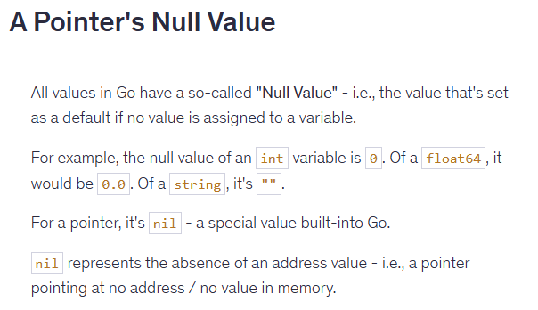

# Go - The Ultimate Guide

### Key Notes

1. In Go, you cannot use single quotes (') for strings. You can use double quotes (") and back ticks (`).  

2. When writing go code, you split your code accross packages. You must have atleast one package per go project or you can have multiple packages as well.

3. You can have multiple files that make up one package.

4. The 'main' package tells go that it the main entry point to the application. The reason behind this is that when we share our go program to people who does have go installed. They wont be able to run it by typing 'go run app.go'. They will need an executable file which can run without installing go. You can create this executable file by running 'go build'  and for this, you need the 'main' package to show the main entry point of our application.

5. Go modules can consists of multiple packages. You can create a module by running 'go mod init {PATH}'.

6. There should aldo be one 'main' func to indicate the entry point of our application. This is required if you are building an executable program. But if you are just building packages like 'fmt' which is there for people to use it, then you don't need a main func in a main package.

7. Go is a statically typed language, so types are important in go.

8. In Go, you can add line breaks in the strings by using back ticks (`). It is useful when the string is too long and you want to break it into multiple lines.

9. In Go, to export a function and make it available for others to use, the function name should start with UpperCase.

10. When you share the code with someone, the user can type 'go get' to install all the dependencies listed in the mod file which are required to run the program.

11. To download a package, simply type 'go get [package-path]'

12. &variable indicates the address of variable in memory and *variable returns the data at the address (dereferencing)

13.

14. In Go you can't perform calculation with Pointer. You can't deduct value from a pointer, you have to first dereference the pointer by using the asteric (*)

15. Using pointer is handy when we are dealing large data or performing complex operation, where optimizing memory usage improves the performance. It is not effective for handling integers, strings as such.

16. Structs are used to group data, functions and methods in a collection

17. In Go, to export a struct the name of the struct should be UpperCase. You can also export the field names, specially when you want to instantiate the struct directly. But you used a constructor function to instantiate the struct then you dont need to expose the field names.